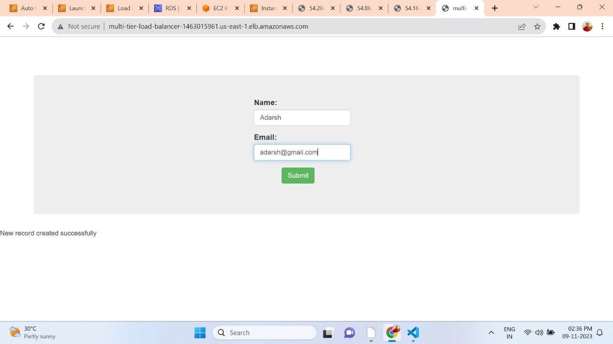

## Deploying a Multi-Tier Website Using AWS EC2 and RDS

In this tutorial, we'll cover the step-by-step process of deploying a multi-tier website on AWS using Amazon EC2 for hosting the website and Amazon RDS for the MySQL database. We'll also set up auto-scaling for high availability and create a load balancer to distribute traffic across multiple instances.

### Prerequisites

Before you begin, ensure you have:

- An AWS account with appropriate permissions.
- Basic knowledge of AWS services like EC2, RDS, and load balancers.

### Step 1: Launching an EC2 Instance

1. **Launch an EC2 Instance**
   - Log in to your AWS Management Console.
   - Navigate to EC2 and click on "Launch Instance."
   - Choose Ubuntu Server as the AMI.
   - Select `t2.micro` as the instance type.
   - Create a new key pair (e.g., `my-keypair`) for SSH access and download the private key.
   - Configure security group (`website-deploy-security-group`) to allow all traffic (0.0.0.0/0).

### Step 2: Setting Up Apache and PHP

2. **Install Apache and PHP**
   ```bash
   sudo apt-get update
   sudo apt-get install apache2 -y
   cd /var/www/html
   sudo rm index.html
   sudo nano index.php
   ```
Add your PHP code in `index.php` to display a basic webpage.

This HTML and PHP code snippet represents a basic web form that collects user input (name and email) and inserts it into a MySQL database hosted on Amazon RDS. Let's break down the code and provide an overview of its functionality:

### HTML Form (index.php)

```html
<!DOCTYPE html>
<html>
<head>
    <title>Simple Form</title>
    <link rel="stylesheet" href="https://maxcdn.bootstrapcdn.com/bootstrap/3.3.7/css/bootstrap.min.css">
    <style>
        body {
            background-image: url('images/2.png');
            background-repeat: no-repeat;
            background-size: 100% 100%;
        }
    </style>
</head>
<body>
    <br><br><br><br>
    <div class="container">
        <div class="jumbotron vertical-center">
            <form method="post">
                <div class="form-group">
                    <label for="firstname">Name:</label>
                    <input type="text" class="form-control" name="firstname">
                </div>
                <div class="form-group">
                    <label for="email">Email:</label>
                    <input type="text" class="form-control" name="email">
                </div>
                <button type="submit" class="btn btn-success">Submit</button>
            </form>
        </div>
    </div>
</body>
</html>
```

- This HTML form includes Bootstrap styling for layout.
- It contains input fields for `Name` (firstname) and `Email`.
- On form submission (`POST` method), it sends data to the same page (`action` is not needed as it defaults to the current URL).

### PHP Script (index.php - Below the HTML form)

```php
<?php
// Retrieve form data
$firstname = $_POST['firstname'];
$email = $_POST['email'];

// Database connection details
$servername = "intelli.coghw13fheqo.us-east-2.rds.amazonaws.com";
$username = "intel";
$password = "intel123";
$dbname = "intel";

// Create connection
$conn = new mysqli($servername, $username, $password, $dbname);

// Check connection
if ($conn->connect_error) {
    die("Connection failed: " . $conn->connect_error);
}

// Check if form is submitted
if (isset($_POST['firstname']) && isset($_POST['email'])) {
    // SQL query to insert data into database
    $sql = "INSERT INTO data (firstname, email) VALUES ('$firstname', '$email')";

    // Execute SQL query
    if ($conn->query($sql) === TRUE) {
        echo "New record created successfully";
    } else {
        echo "Error: " . $sql . "<br>" . $conn->error;
    }
}

// Close database connection
$conn->close();
?>
```

- This PHP script handles the form submission.
- It retrieves the `firstname` and `email` values from `$_POST`.
- Establishes a connection to the MySQL database using `mysqli`.
- If form data is submitted (`isset($_POST['firstname']) && isset($_POST['email'])`), it constructs an SQL query to insert the data into the `data` table.
- Executes the SQL query and displays a success or error message accordingly.
- Closes the database connection after processing.

### Summary

This code snippet demonstrates a simple web form that captures user input and inserts it into an Amazon RDS MySQL database. Ensure that the database connection details (`$servername`, `$username`, `$password`, `$dbname`) are correct and match your RDS instance configuration. Additionally, replace `'images/2.png'` with the path to your desired background image.

Make sure to handle form validation, error handling, and security considerations (e.g., SQL injection prevention) based on your application requirements.

### Step 3: Setting Up RDS Database

3. **Create an RDS Instance**
   - Navigate to RDS in the AWS Management Console.
   - Click on "Create database" and choose MySQL as the engine.
   - Configure database details (e.g., `multi-tier-website-DB`).
   - Set master username and password.
   - Connect the RDS instance to the EC2 instance's security group.

### Step 4: Configuring Website to Use RDS

4. **Configure PHP to Connect to RDS**
   ```bash
   sudo apt-get install mysql-server -y
   sudo mysql -h multi-tier-website-db.cvwwkjmmcvgi.us-east-1.rds.amazonaws.com -u admin -padmin123
   ```
   Execute the following SQL commands:
   ```sql
   show databases;
   use intel;
   create table data(firstname varchar(20), email varchar(20));
   insert into data values('AWS', 'aws@support.com');
   select * from data;
   ```

### Step 5: Enabling Auto Scaling and Load Balancing

5. **Create Load Balancer and Auto Scaling Group**
   - Create an AMI from the EC2 instance.
   - Navigate to EC2 > Instances, select your instance, and click "Actions" > "Image and templates" > "Create image."
   - Set up an Application Load Balancer (ALB) in the AWS Management Console.
   - Create a target group for instances.
   - Configure auto-scaling group with the created AMI and ALB.

### Step 6: Testing and Verification

6. **Testing the Setup**
   - Access the website through the load balancer's DNS.
   - Add data to the website and verify database entries.

### Conclusion

Congratulations! You've successfully deployed a multi-tier website on AWS using EC2 for web hosting, RDS for database management, and auto-scaling for high availability. Feel free to customize and expand upon this setup based on your project requirements.



### Additional References

For more information and detailed documentation, refer to the following links:

- [AWS EC2 Documentation](https://docs.aws.amazon.com/ec2/)
- [AWS RDS Documentation](https://docs.aws.amazon.com/rds/)
- [AWS Auto Scaling Documentation](https://docs.aws.amazon.com/autoscaling/)
- [AWS Elastic Load Balancing Documentation](https://docs.aws.amazon.com/elasticloadbalancing/)


